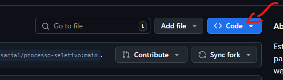
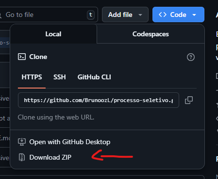

# 💢 Teste Prático - Estágio de Programação Web: INTEGRALE

## 📋 Descrição do Projeto:
### Página web simples
- Um formulário de cadastro com os seguintes campos:
  - **Nome**
  - **E-mail**
  - **Senha**
- Um botão de submit que exiba os dados preenchidos em um alerta (popup) ao clicar.
- A página é **responsiva**.

## 📲 Vizualizar o Projeto:
### Para poder vizualizar o projeto, existe duas formas.

#### 1° Forma - Usar GIT CLONE no repositório:
```
git clone https://github.com/BrunoozL/processo-seletivo
```

#### 2° Forma - Baixar diretamente pelo repositório:
Entrando dentro do repositório do Projeto, no centro da tela onde estão os aruivos do projeto, um pouco acima  
no canto superior, clique no botão azul escrito "CODE" e logo em seguida, no botão "DOWNLOAD ZIP".





### E dessas 2 formas, você consegue ter o projeto em mãos!

## ✨ Linguagens/Ferramentas utilizadas:

<div style="display: inline_block;">
   
  
  
  
  